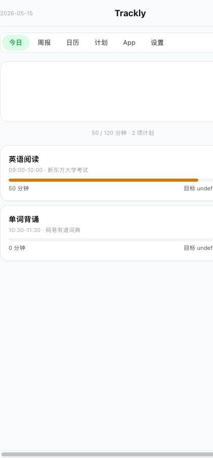
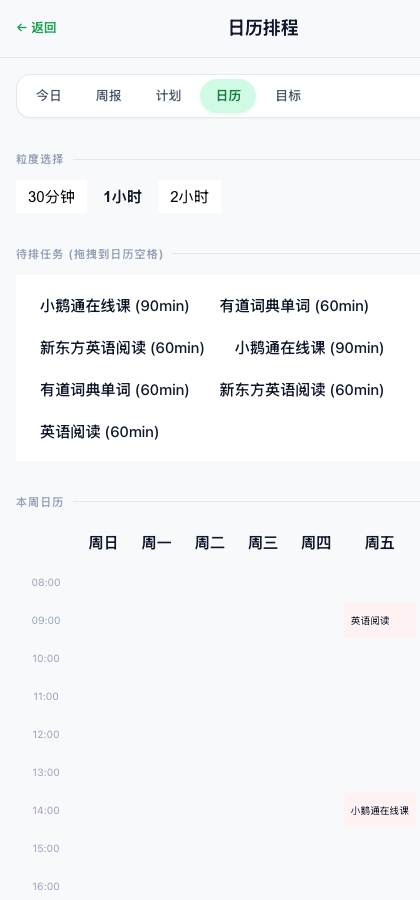
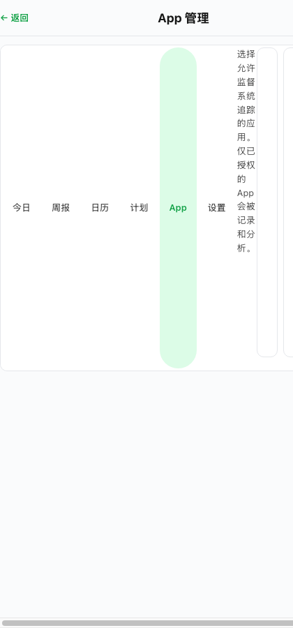
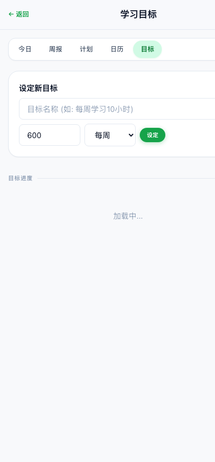
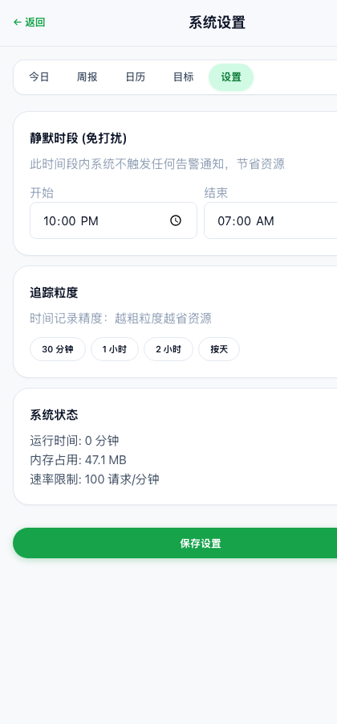
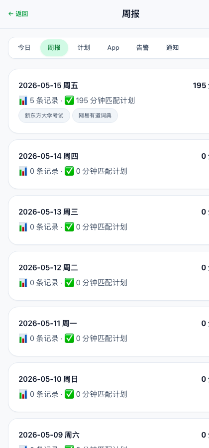

<div align="center">


</div>

<h1 align="center">Trackly</h1>

<p align="center">
  <strong>学习监督 · 自动追踪 · 智能提醒</strong><br>
  <sub>计划 → 追踪 → 比对 → 告警 → 完成</sub>
</p>

---

## 这是什么？

一个面向**学生和家长**的跨平台学习监督系统。

学生在 iPad / iPhone / Android 上学习，系统自动追踪、比对计划、在落后时推送提醒。上传 Excel 课程表即可自动排程，支持日历拖拽。

**学习越久，树越大。** 仪表盘上一棵 Canvas 实时生长的树 —— 进度 0% 是幼苗，100% 是参天大树。没完成？树会枯萎。趣味化学习激励。

### 平台支持

| 平台 | 角色 | 方式 |
|------|------|------|
| **iPad** | 学生学习端 | Safari 访问仪表盘 + iOS 快捷指令自动上报 |
| **iPhone** | 监督者查看端 | Safari 移动端仪表盘，丝滑触控 |
| **Android** | 学生学习端 | Chrome 访问仪表盘 + Tasker 自动化上报 |
| **Mac / PC** | 管理端 | 完整仪表盘 + ActivityWatch 桌面追踪 |

## 截图预览

<div align="center">

| 今日仪表盘 | 日历拖拽排程 |
|:--:|:--:|
|  |  |

| App 权限管理 | 学习目标追踪 |
|:--:|:--:|
|  |  |

| 系统设置 | 周报统计 |
|:--:|:--:|
|  |  |

</div>

### 丝滑交互

- **养树激励** — Canvas 实时生长的树，学习进度=树的深度
- **拖拽排程** — 日历页直接拖任务到空格，即时安排
- **一键开关** — App 权限 toggle 即时生效
- **自动刷新** — 数据每 30 秒自动更新

## 快速开始

```bash
# 1. 安装
cd backend && npm install
npx prisma generate && npx prisma db push

# 2. 配置
cp ../.env.example .env

# 3. 启动
npm run dev
# → http://localhost:3001/dashboard?userId=student-1
```

### iPad / iPhone 配置

打开/关闭学习 App 自动上报 → 参见 [`shortcuts/README.md`](shortcuts/README.md)

配置 3 步：创建自动化 → 选 App 触发器 → 填后端 URL（每 App 2 个自动化，共 1 分钟搞定）

### Android 配置

使用 Tasker 或 Macrodroid 创建 App 打开/关闭触发器，POST 到 `http://服务器IP:3001/api/v1/tracking/push`

## 功能矩阵

| 功能 | iPad | iPhone | Android | Web |
|------|:--:|:--:|:--:|:--:|
| 自动追踪 (快捷指令) | ✅ | ✅ | ✅ | — |
| 移动仪表盘 | ✅ | ✅ | ✅ | ✅ |
| 拖拽日历排程 | ✅ | ✅ | ✅ | ✅ |
| Excel 课程表导入 | ✅ | ✅ | ✅ | ✅ |
| Bark 推送 | ✅ | ✅ | — | — |
| 微信/飞书通知 | ✅ | ✅ | ✅ | ✅ |
| 学习目标追踪 | ✅ | ✅ | ✅ | ✅ |
| App 权限管理 | ✅ | ✅ | ✅ | ✅ |
| 静默时段设置 | ✅ | ✅ | ✅ | ✅ |

## API 概览

| 端点 | 用途 |
|------|------|
| `POST /api/v1/tracking/push` | 设备上报追踪数据 |
| `CRUD /api/v1/plans/*` | 学习计划管理 |
| `POST /api/v1/excel/upload` | Excel 任务表上传 |
| `POST /api/v1/excel/course-schedule` | 课程表解析排程 |
| `POST /api/v1/excel/auto-schedule` | 日历联动自动排程 |
| `CRUD /api/v1/goals/*` | 学习目标管理 |
| `GET /api/v1/dashboard/today` | 今日仪表盘数据 |
| `GET /api/v1/dashboard/weekly` | 周汇总 |
| `GET/PUT /api/v1/settings` | 静默时段/粒度设置 |
| `GET /health` | 健康检查 |

## 架构

```
iPad/iPhone (学习App)  Android (学习App)
     │                      │
     │ 快捷指令/Tasker       │ HTTP POST
     ▼                      ▼
       ┌──────────────────┐
       │  Trackly 后端     │ ← Super Productivity (计划)
       │  Fastify+SQLite  │ ← iPad 日历 (iCal)
       │  (压缩+限流+缓存) │ ← Excel 课程表
       └──────┬───────────┘
              │
    ┌─────────┼─────────┐
    ▼         ▼         ▼
  Bark    微信/飞书   移动仪表盘
 (学生)   (监督者)    (9页面)
```

## 技术栈

| 层 | 技术 |
|---|------|
| 后端 | Node.js + Fastify + TypeScript |
| 数据库 | SQLite + Prisma (7 模型) |
| 前端 | Eta SSR + 移动优先 CSS 设计系统 |
| 优化 | gzip/brotli 压缩 + 限流 + 内存缓存 |
| 追踪 | ActivityWatch (桌面) + 快捷指令 (移动) |
| 打包 | pkg → macOS/Win/Linux 独立可执行文件 |
| 容器 | Docker + Docker Compose |

## License

MIT
