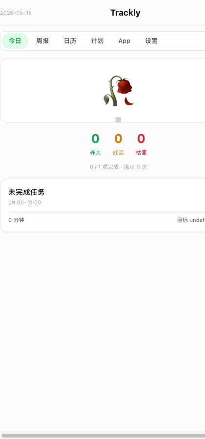

<div align="center">


<h1>Trackly</h1>
<h3>学习监督 · 养树激励 · 自动追踪</h3>

> ⚠️ **仅供个人/家庭使用，严禁任何商业行为。** 详见 [LICENSE](LICENSE)

</div>

---

## 这是什么

学生在 iPad 上学习，系统自动追踪、比对计划、在落后时推送提醒。每完成一个任务，仪表盘上的树就长大一级。没完成？树会枯萎。

## 养树

| 养大 | 成活 | 枯萎 |
|:--:|:--:|:--:|
|  | — |  |
| 完成任务 → 浇水 → 树生长 | 部分完成 → 半大树 | 0 完成 → 灰色死树 |

> 树的状态由任务完成数决定，不跟时钟走。每个任务完成即时浇一次水。

## 截图

<div align="center">

<a href="docs/screenshots/1-dashboard.png"></a>
<a href="docs/screenshots/7-dead-tree.png"></a>
<a href="docs/screenshots/2-calendar.png"></a>
<a href="docs/screenshots/3-apps.png"></a>

</div>

## 安装与启动（手把手）

**你需要什么：** 一台电脑（Mac/Windows 都行），一部 iPad/手机。

**所有东西都跑在这台电脑上，不需要买服务器。** 微信和飞书通知通过第三方免费服务中转。

### 下载 & 启动（选一种）

| 你的水平 | 推荐方式 | 说明 |
|----------|----------|------|
| 完全不懂代码 | 找会的人发你 `Trackly-v1.0.zip`，解压双击 `Trackly.app` | 一次打包，永久使用 |
| 懂一点命令行 | Docker：`docker compose up -d` | 一条命令 |
| 会写代码 | 源码：`cd backend && npm install && npm run dev` | 可修改 |

**方式 A — 源码启动（需要 Node.js）**

```bash
cd backend && npm install
npx prisma generate && npx prisma db push
cp ../.env.example .env   # 编辑填入配置（可选，不填也能用）
npm run dev               # → http://localhost:3001
```

**方式 B — 独立 EXE / App（推荐给别人用，无需装任何东西）**

```bash
bash scripts/release.sh   # 生成 release/ 目录
```

生成的文件在 `release/` 里：

| 文件 | 用途 |
|------|------|
| `Trackly.app` | **Mac 双击启动**（自动开浏览器） |
| `🌳启动.command` | Mac 备选启动方式 |
| `supervised-learning-macos` | Mac 底层可执行文件（177MB，内置 Node.js） |
| `supervised-learning-win.exe` | Windows 可执行文件 |
| `supervised-learning-linux` | Linux 可执行文件 |

> **发给朋友：** 把整个 `release/` 文件夹打包成 ZIP 发过去。对方解压后双击 `Trackly.app`（Mac）或 `supervised-learning-win.exe`（Windows）即可。
>
> **Mac 首次打开提示"无法验证"：** 右键 `Trackly.app` → 选「打开」→ 点「打开」即可。之后双击正常启动。

**方式 C — Docker（一条命令）**

```bash
docker compose up -d      # 后端启动，浏览器打开 http://localhost:3001
```

### 朋友 / 其他设备怎么访问

Trackly 跑在你的电脑上，**同一 WiFi 下的设备都能访问**。

**找到你的电脑 IP：**

```bash
# Mac 终端运行：
ifconfig | grep "inet " | grep -v 127.0.0.1
# 会显示类似 192.168.1.104
```

**其他人访问：** 浏览器打开 `http://你的IP:3001/dashboard?userId=xxx`

| 设备 | 打开方式 |
|------|----------|
| **Mac / Windows** | 浏览器打开 `http://电脑IP:3001/dashboard?userId=student-1` |
| **iPad / iPhone** | Safari 打开 → 分享 → 添加到主屏幕 → 像 App 一样用 |
| **Android** | Chrome 打开 → 添加到主屏幕 |

> **不同人用不同 userId**：`?userId=小明`、`?userId=小红`，每人独立数据互不干扰。

## 角色说明

| 角色 | 谁 | 做什么 |
|------|-----|------|
| **学生** | 被监督的学习者 | iPad 上学习，自动记录时长，接收进度提醒 |
| **监督者** | 家长/老师 | 手机查看进度，接收落后通知 |

> 学生和监督者都是完全不懂技术的小白。只有部署者（你）需要会改代码。

## 功能

- 学习计划管理 + Excel 课程表导入
- iPad 日历(iCal)联动，自动找空闲时段排任务
- 日历拖拽排程，30分/1时/2时/按天 粒度
- 打开/关闭学习 App 自动记录时长（iOS 快捷指令）
- 进度落后自动推送到学生和监督者（Bark/微信/飞书）
- 计划结束后 15 分钟未完成 → 通知监督者
- 静默时段自定义，夜间自动休眠省资源
- 9 页移动端仪表盘

## 各设备使用方法

### 部署后端（Mac / Windows / Linux 任选一台）

电脑上启动后端服务，iPad/手机通过局域网或公网访问。

| 方式 | 说明 | 适合 |
|------|------|------|
| **A — 源码启动** | `cd backend && npm install && npm run dev` | 开发者 |
| **B — 独立 EXE** | `bash scripts/release.sh` 生成，双击运行 | 无需装 Node.js |
| **C — Docker** | `docker compose up -d` | 一条命令启动 |

**方式 A — 源码启动**
```bash
cd backend && npm install
npx prisma generate && npx prisma db push
cp ../.env.example .env   # 编辑填入 Bark Key 等
npm run dev               # → http://localhost:3001
```

**方式 B — 独立 EXE（无需装 Node.js）**
```bash
bash scripts/release.sh   # 生成 supervised-learning-macos / -win.exe / -linux
# 双击运行即可
```

**方式 C — Docker**
```bash
docker compose up -d      # 后端 + Super Productivity 一起启动
```

### iPad / iPhone（学生学习端）

| 步骤 | 操作 |
|------|------|
| 1 | Safari 打开 `http://服务器IP:3001/dashboard?userId=student-1` |
| 2 | 点分享 → 添加到主屏幕 → 像原生 App |
| 3 | 打开系统「快捷指令」App |
| 4 | 自动化 → 创建个人自动化 → App → 选学习 App → 已打开 |
| 5 | 添加动作「获取 URL 内容」→ POST `http://服务器IP:3001/api/v1/tracking/push` |
| 6 | Body: `{"userId":"student-1","action":"start","appName":"新东方","timestamp":"当前日期"}` |
| 7 | 再创建一个「已关闭」的自动化，action 改为 `"end"` |
| 8 | 每个学习 App 重复步骤 4-7 |

安装 **Bark** App 接收推送：App Store 搜 Bark → 安装 → 复制 DeviceKey 填入 `.env`

### Android（学生学习端）

| 步骤 | 操作 |
|------|------|
| 1 | Chrome 打开 `http://服务器IP:3001/dashboard?userId=student-1` |
| 2 | 添加到主屏幕 |
| 3 | 安装 Tasker 或 Macrodroid |
| 4 | 创建触发器：App 打开/关闭 → HTTP Request POST 到后端 |
| 5 | Body 同上，`action` 用 `"start"` / `"end"` |

### 监督者（家长手机查看）

| 步骤 | 操作 |
|------|------|
| 1 | 手机浏览器打开 `http://服务器IP:3001/dashboard?userId=student-1` |
| 2 | 查看今日进度、周报、告警历史 |
| 3 | 切换到「推送设置」页 |
| 4 | 配置微信（Server酱）或飞书（群机器人）→ 见下方说明 |

## 通知渠道配置

两种渠道都**不需要自己的服务器**。用第三方免费服务中转，扫码即授权。

### 微信通知（通过 Server酱 中转）

| 步骤 | 操作 |
|------|------|
| 1 | 打开 [sct.ftqq.com](https://sct.ftqq.com) |
| 2 | **微信扫码** → 点确认 → 复制 SendKey |
| 3 | 把 SendKey 告诉部署者（或自己填入 `.env` 的 `SERVERCHAN_SEND_KEY`） |
| 4 | 关注 Server酱 公众号 |
| 5 | 推送设置页可以直接填，不用改 `.env` |

扫码 = 授权 Trackly 以你的名义发微信消息。收到后可以转发或截图发朋友圈。

### 飞书通知（通过群机器人 Webhook）

| 步骤 | 操作 |
|------|------|
| 1 | 打开飞书 → 进入群聊（或建一个新群） |
| 2 | 群设置 → 群机器人 → 添加 → **自定义机器人** |
| 3 | 安全设置：勾选「仅签名为密钥的消息」 |
| 4 | 复制 Webhook 地址 → 发给部署者 |
| 5 | 部署者填入 `.env` 的 `FEISHU_WEBHOOK_URL`（或在推送设置页直接填） |

> 不需要服务器、不需要 IP 白名单、不需要回调地址。飞书群直接收到消息。

## API

| 端点 | 用途 |
|------|------|
| `POST /api/v1/tracking/push` | 设备上报追踪 |
| `CRUD /api/v1/plans/*` | 计划管理 |
| `POST /api/v1/excel/upload` | Excel 任务表 |
| `POST /api/v1/excel/auto-schedule` | 日历自动排程 |
| `CRUD /api/v1/goals/*` | 学习目标 |
| `GET /api/v1/dashboard/today` | 今日数据 |
| `GET/PUT /api/v1/settings` | 静默时段/粒度 |

## 技术

Fastify + TypeScript + Prisma + SQLite · gzip/brotli · 限流 · Canvas 养树

## License

**Non-Commercial Only** — 严禁任何层面商业使用。详见 [LICENSE](LICENSE)。
